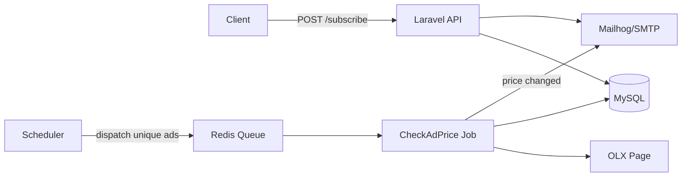

# OLX Price Watcher (Laravel + Docker)

Сервіс для відстеження змін ціни оголошень на OLX з підпискою по email, підтвердженням пошти, чергами та планувальником.

## Quick start

```bash
cd olx-price-watcher
composer install
cp .env.example .env
docker compose up -d --build
docker compose exec app php artisan key:generate
docker compose exec app php artisan migrate
```

- Веб: http://localhost:8081
- Mailhog: http://localhost:8025

## API
- POST `/api/subscribe` — `{ "url": "...", "email": "..." }`
- GET `/api/verify?token=...`
- GET `/api/subscriptions?email=...`

## Scheduler
- `docker-compose exec app php artisan ads:update-prices`

Check that the job is running:

- `docker-compose exec app php artisan queue:work`

Також можно організувати Supervisor і додати додавання в чергу по крону.

## Schema

